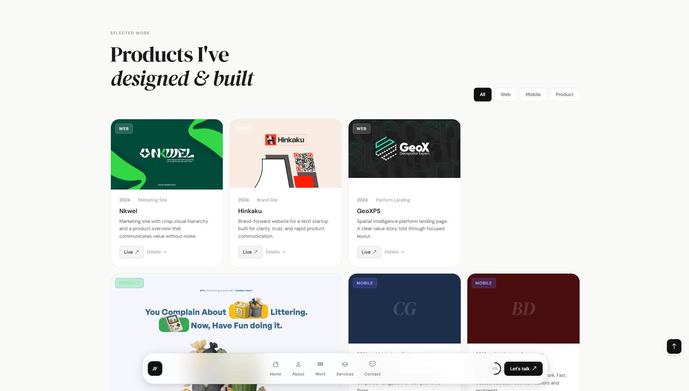

# MinimalFolio — Joël Fah Portfolio

Personal portfolio of **Joel Fah**, product designer and builder. Fully redesigned and personalized.


## Overview

- Single-page portfolio with dedicated project and service detail pages.
- Bottom dock navigation with progress ring and mobile menu.
- Dynamic project/service rendering from data objects in JavaScript.
- Zero build step: plain HTML, CSS, and JS.

## Tech stack

| Layer | Technology |
|---|---|
| CSS framework | Bootstrap 5.3 (via CDN) |
| Icons | Bootstrap Icons 1.11 |
| Typography | DM Sans + DM Serif Display (Google Fonts) |
| Interactions | Vanilla JavaScript (ES2020, no frameworks) |
| Animations | CSS transitions + IntersectionObserver API |
| Build | None — ships as-is |

## Structure

```
/
├── index.html
├── portfolio-details.html
├── service-details.html
├── assets/
│   ├── css/
│   │   └── main.css
│   ├── js/
│   │   ├── main.js
│   │   ├── portfolio-details.js
│   │   └── service-details.js
│   ├── img/
│   └── docs/
└── README.md
```

## Run locally

Open `index.html` in your browser or serve the folder with any static server.

## Screenshots


## License

Portfolio content and custom design © 2026 Joel Fah.
