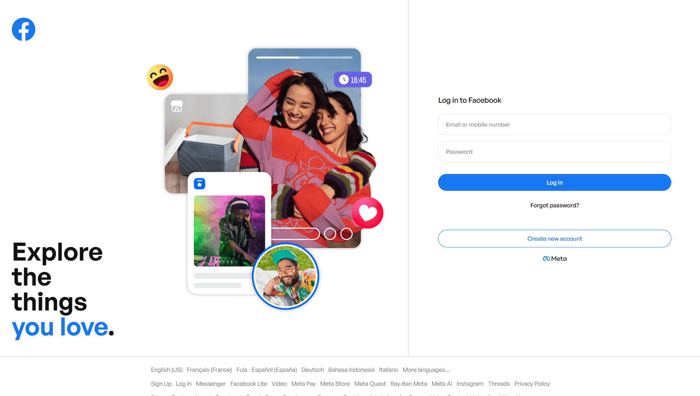

# Advanced Web Exercises

A series of tasks to be carried out for the Advanced Web Development course. Each folder represents a distinct practical project focusing on different aspects of front-end and web development.

## Projects So Far

### 1. Facebook Clone (`facebook-clone`)
A static UI clone of the Facebook authentication flow, demonstrating form building, layout techniques, and modern web styling.

### 2. ICTU Dashboard (`ictu-dashboard`)
An administrative dashboard replica designed for ICT Univesity to practice complex grid/flexbox layouts and dashboard component design.

### 3. Pope Leo's Visit to Cameroon (`pope-leo-cameroon`)
A commemorative web page documenting detailed events, quotes, and insights into the Pope's historic visit to Cameroon.
