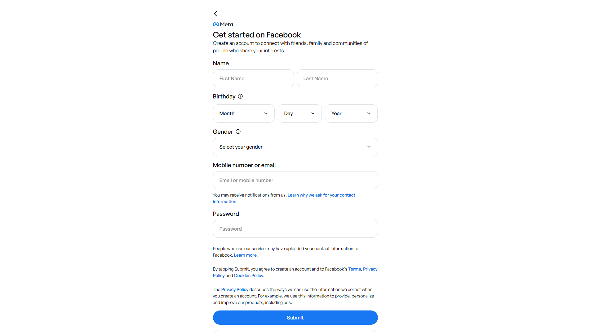

# Facebook UI Clone




A pixel-faithful recreation of Facebook's splash screen, login page, and registration page — built with **plain HTML and CSS** (no frameworks, no preprocessors). Includes minimal **Vanilla JavaScript** for simple interactions.

---

## Project Structure

```
facebook-clone/
├── splash.html          # Preloader / Splash screen (entry point)
├── login.html           # Login page
├── register.html        # Registration / Sign-up page
│
├── css/
│   ├── main.css         # Global styles, variables, and font imports
│   ├── splash.css       # Styles for the splash screen
│   ├── login.css        # Styles for the login page
│   └── register.css     # Styles for the registration page
│
├── js/                  # Directory for external scripts (currently empty, scripts are inline)
│
├── assets/
│   ├── fonts/           # Local font files (General Sans)
│   ├── images/          # Content images (e.g., login promo)
│   └── logos/           # Facebook and Meta brand assets
│
└── README.md            # This file
```

---

## Pages

### 1. Splash Screen (`splash.html`)
- Displays a centered Facebook logo on a white background.
- Shows the Meta wordmark pinned to the bottom.
- Automatically redirects to `login.html` after **2.2 seconds**.
- Animated with a pop-in effect for the logo and a fade-up for the Meta logo.

### 2. Login Page (`login.html`)
- Two-column grid layout (CSS Grid):
  - **Left panel** — Facebook icon, tagline ("Explore the things you love."), and a promotional hero image.
  - **Right panel** — Login form with input fields, "Log In" button, "Forgot password?" link, "Create new account" button (links to `register.html`), and Meta branding.
- Fully responsive: Stacks to a single-column layout on smaller screens.

### 3. Registration Page (`register.html`)
- Single-column card layout centered on the page.
- Back arrow (returns to `login.html`) + Meta logo header.
- Form fields:
  - **Name** — First name / Last name in a 2-column CSS Grid row.
  - **Birthday** — Month / Day / Year dropdowns in a 3-column CSS Grid row. The Year dropdown is dynamically populated via vanilla JavaScript (current year down to 1905).
  - **Gender** — Full-width styled `<select>`.
  - **Mobile number or email** — Text input with helper copy.
  - **Password** — Password input.
- Legal copy (Terms, Privacy Policy, Cookies Policy links).
- Submit button and "Already have an account?" link back to login.

---

## Technologies Used

| Technology | Usage |
|---|---|
| HTML5 | Semantic markup, form elements |
| CSS3 | Layout (Grid + Flexbox), variables, animations, responsive design |
| Vanilla JS | Year dropdown population; splash screen redirect |
| SVG | Facebook logo, Meta wordmark (inline/external) |

> No external libraries, CDNs, or build tools required.

---

## Design Notes

- **CSS Custom Properties** (`--fb-blue`, `--border`, etc.) are declared in each stylesheet's `:root` to keep theming consistent and easily adjustable.
- **CSS Grid** drives the two-panel login layout and the name/birthday multi-field rows.
- **Flexbox** handles inner card alignment, button stacking, and footer link wrapping.
- **CSS animations** (`@keyframes`) power the splash screen entrance (pop-in + fade-up).
- All custom `<select>` elements use `appearance: none` with a custom SVG chevron for cross-browser consistency.
- Colour palette exactly matches Facebook's design system: `#1877F2` (blue), `#42B72A` (green), `#F0F2F5` (page background), `#CED0D4` (borders).

---

## How to Run

No build step needed. Simply open the entry point in any modern browser:

```bash
# Option 1: Open directly
open splash.html

# Option 2: Serve locally (recommended to avoid file:// CORS quirks)
npx serve .
# or
python3 -m http.server 8080
```

Then navigate to `http://localhost:8080/splash.html`.

---

## Flow

```
splash.html  ──(2.2s)──►  login.html  ──(Create account)──►  register.html
                                ▲                                    │
                                └──────────── (Already have one?) ──┘
```

---

## Browser Support

Tested and compatible with all modern browsers:
- Chrome / Edge 90+
- Firefox 90+
- Safari 14+
- Mobile Safari / Chrome (responsive layout)
