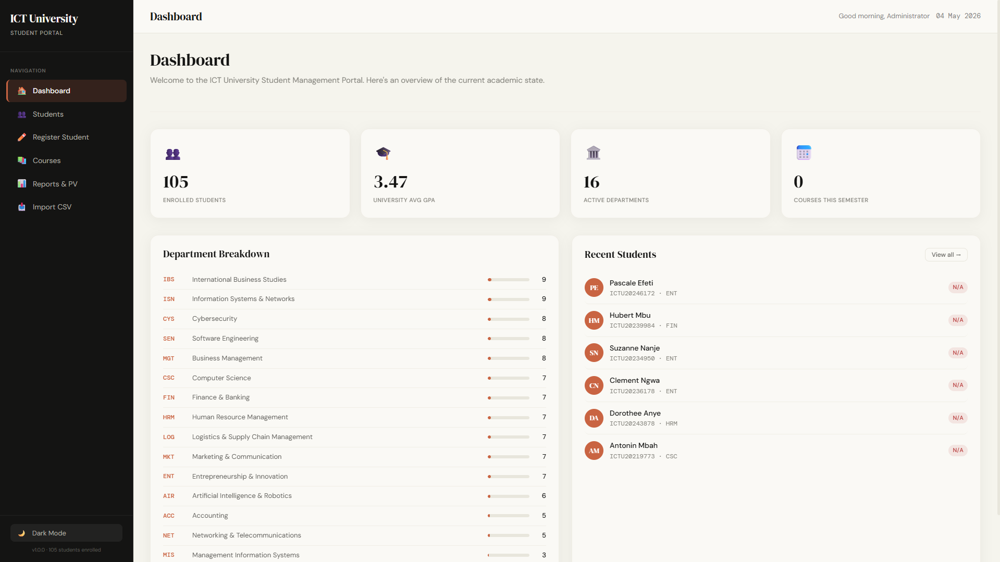
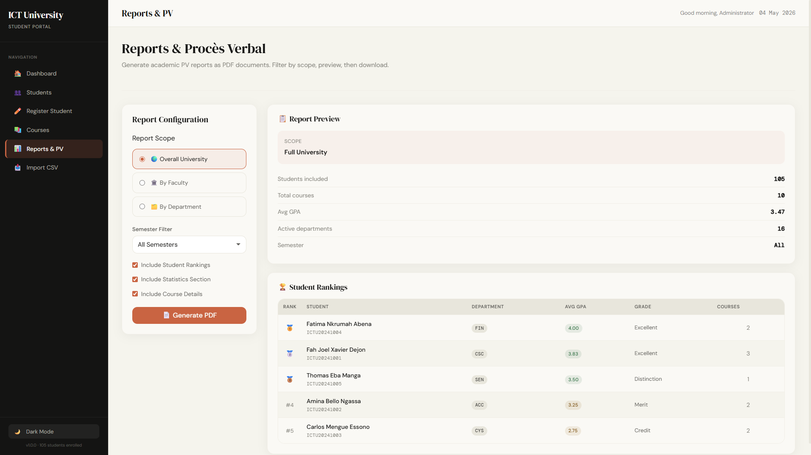

# ICTU Smart Student Management Dashboard




A fully client-side Student Management System for ICT University, built with plain HTML, CSS, and Vanilla JavaScript. No backend, no build tools — just open `index.html` in a browser.

## 🚀 Getting Started

### Option A — Open directly
Simply open `index.html` in any modern browser. Due to browser security policies around local file access, use a local server for the best experience.

### Option B — Local server (recommended)
```bash
# Python
python3 -m http.server 8080

# Node.js
npx serve .

# VS Code
Install "Live Server" extension, right-click index.html → Open with Live Server
```
Then visit `http://localhost:8080`

## 📁 Project Structure

```
ictu-dashboard/
├── index.html              # Dashboard overview
├── pages/
│   ├── students.html       # Student list, search, filter
│   ├── register.html       # Add / Edit student
│   ├── courses.html        # Course records per student
│   ├── reports.html        # PV PDF generation + rankings
│   └── import.html         # CSV bulk import
├── css/
│   ├── variables.css       # Design tokens
│   ├── base.css            # Typography reset
│   ├── components.css      # Buttons, cards, forms, table
│   ├── layout.css          # Sidebar, topbar, responsive
│   ├── pages/              # Page-specific styles
│   └── dark-mode.css       # Dark theme overrides
├── js/
│   ├── data/faculties.js   # Faculty & department data
│   ├── core/               # Storage, validators, utils, theme
│   ├── components/         # Sidebar, modal, toast
│   └── pages/              # Page logic
└── sample-data/
    └── students_100.csv    # 100 sample students for testing
```

## ✨ Features

| Feature | Details |
|---------|---------|
| **Student CRUD** | Add, edit, delete students with full validation |
| **Real-time Search** | Debounced search by name or student ID |
| **Filters** | By faculty, department, level — all dynamic |
| **Sorting** | By name, GPA, newest/oldest |
| **Course Records** | Per-student course management with grade entry |
| **GPA Calculation** | Auto-computed from 20-point grades → 4.0 GPA scale |
| **Student Rankings** | Auto-ranked by avg GPA within any scope |
| **PV PDF Export** | Full procès verbal with rankings, stats, course details |
| **CSV Import** | Bulk import with preview and validation |
| **Dark Mode** | Toggle persisted in localStorage |
| **Responsive** | Works on desktop, tablet, and mobile |
| **Data Persistence** | All data saved in localStorage |
| **AOS Animations** | Smooth scroll-triggered animations |

## 📊 GPA Scale

| Grade (/20) | GPA (4.0) | Mention |
|-------------|-----------|---------|
| 16–20 | 4.0 | Excellent |
| 14–15.99 | 3.5 | Distinction |
| 12–13.99 | 3.0 | Merit |
| 10–11.99 | 2.5 | Credit |
| 8–9.99 | 2.0 | Pass |
| 6–7.99 | 1.5 | Pass |
| 0–5.99 | 1.0 | Fail |

## 🎓 Faculties & Departments

**ICT Faculty**: ISN, CSC, CYS, SEN, DAN, AIR, NET, MIS  
**BMS Faculty**: ACC, FIN, MGT, MKT, HRM, ENT, IBS, LOG

## 📥 CSV Import Format

```csv
StudentID,FullName,Email,Faculty,Department,Level
ICTU20241001,Joel Xavier Dejon,joel@ictuniversity.edu.cm,ICT,CSC,3
ICTU20241002,Amina Bello,amina@gmail.com,BMS,ACC,2
```

See `sample-data/students_100.csv` for a ready-to-use test file.

## 🎨 Design System

Follows the **Anthropic/Claude design language**:
- Warm parchment canvas `#f5f4ed`
- Terracotta brand accent `#c96442`  
- DM Serif Display for headings
- DM Sans for UI text
- Ring-based shadow system
- Warm-toned neutral palette

## 📄 PDF Reports

Reports include:
- University header with scope label and generation date
- Full student roster table
- Student rankings with medals (🥇🥈🥉)
- Course detail records
- Department statistics breakdown
- Page numbers and footer on every page

Filter by: Overall University / By Faculty / By Department / By Semester
