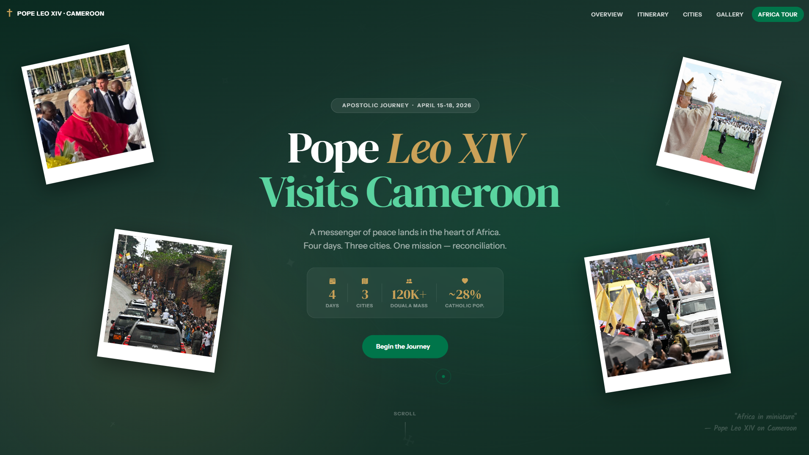
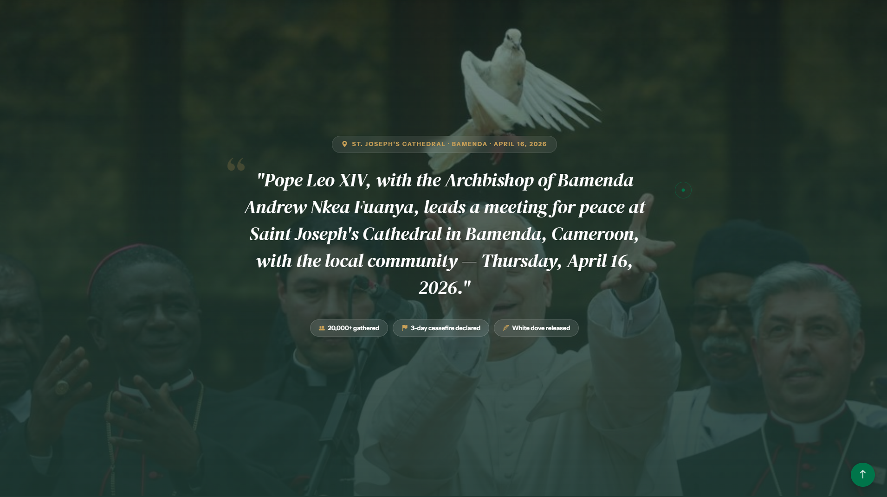

# Pope Leo's Visit to Cameroon


This folder contains a web project documenting Pope Leo's historic visit to Cameroon. It was developed as part of the Advanced Web Development course exercises.

---

## 🚀 Getting Started

No build step needed. Simply open the entry point in any modern browser:

```bash
# Option 1: Open directly
open index.html

# Option 2: Serve locally (recommended)
npx serve .
# or
python3 -m http.server 8080
```

## 📁 Project Structure

```
pope-leo-cameroon/
├── index.html        # Main landing page
├── css/
│   └── style.css     # Custom styling and typography (Variables, animations)
├── js/
│   └── main.js       # Preloader logic, custom cursor, AOS initialization
├── assets/
│   ├── docs/         # Documentation screenshots
│   └── images/       # Event images, branding, and favicon
└── README.md         # This file
```

## ✨ Features

- **Custom Interactive Cursor**: A stylized tracking dot and ring for a premium reading experience.
- **Preloader / Splash Screen**: Elegant timed entry transition before revealing the content.
- **Scroll Animations**: Smooth element reveal animations on scrolling down, powered by AOS.
- **Responsive Layout**: Built with Bootstrap grids and utilities for seamless adaptivity across all mobile and desktop viewports.
- **Modern Styling**: Extensive use of CSS Custom Properties (`:root`), mapping out typography, custom colors, and shadow elevations.

## 🛠️ Technologies Used

| Technology | Usage |
|---|---|
| HTML5 | Semantic page structure |
| CSS3 | Theming (CSS Variables), layout, scroll behavior |
| Vanilla JS | Mouse pointer tracking, preloader timing, library init |
| Bootstrap 5.3 | Responsive grid system, UI utility classes, Icons |
| AOS Library | Scroll-triggered entrance animations |
| Google Fonts | DM Serif Display, Instrument Sans, Kalam |

---

## Screenshots

Here is a glimpse of the webpage sections:

### Main Quote Section

